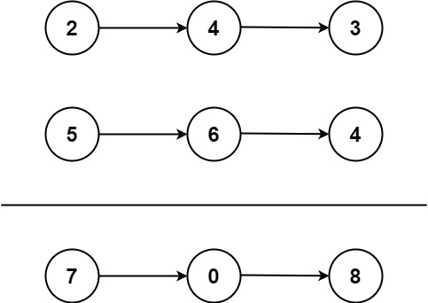

Вам даны два непустых связанных списка, представляющих два неотрицательных целых числа. Цифры хранятся в обратном порядке, и каждый из их узлов содержит одну цифру. Сложите два числа и верните сумму в виде связанного списка.

Вы можете предположить, что эти два числа не содержат ведущих нулей, кроме самого числа 0.

Input: l1 = [2,4,3], l2 = [5,6,4]
Output: [7,0,8]
Explanation: 342 + 465 = 807.
Example 2:

Input: l1 = [0], l2 = [0]
Output: [0]
Example 3:

Input: l1 = [9,9,9,9,9,9,9], l2 = [9,9,9,9]
Output: [8,9,9,9,0,0,0,1]